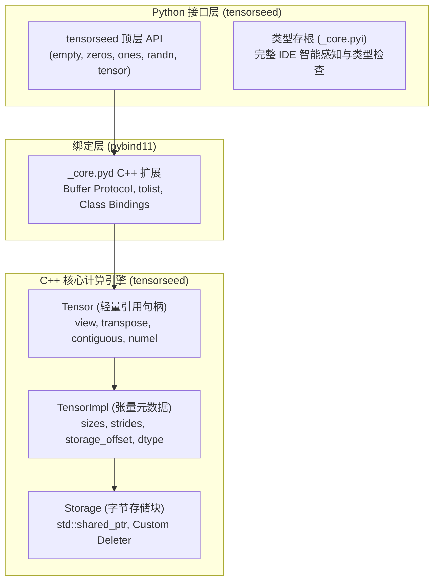

# 🌱 TensorSeed

**TensorSeed** 是一个使用现代 **C++17** 构建、具有 **Python 绑定** 的轻量级、高性能 **类 PyTorch 深度学习张量计算引擎**。

它从零实现了多维跨步存储（Strided Memory Layout）、零拷贝视图变换（Zero-Copy Views）以及 Python 原生缓冲区协议（Buffer Protocol），旨在提供简洁清晰的张量底层架构参考与可扩展的张量计算基础。

---

## 🌟 核心特性 (Features)

- **⚡ 高性能零拷贝视图 (Zero-Copy Views)**：
  - 支持 `view()`（高维形状重塑与 `-1` 维度自动推导）、`transpose()`（任意维度转置）和 `t()`（2D 矩阵快速转置）。
  - 所有视图变换仅修改步长（`strides`）和偏移量（`storage_offset`），无需进行数据拷贝。
- **🧱 经典三层解耦架构**：
  - `Storage`（原始字节缓冲区管理，支持外部内存借用与自定义释放器）。
  - `TensorImpl`（张量核心元数据：形状 `sizes`、步长 `strides`、偏移量与数据类型）。
  - `Tensor`（上层轻量句柄与算子操作接口）。
- **🔢 丰富的数据类型支持 (Multi-Dtype)**：
  - 支持 `float32`、`float64`、`int32`、`int64`、`uint8`。
- **🎲 多样化张量工厂方法**：
  - `ts.empty()`：未初始化内存高速分配。
  - `ts.zeros()`：显式内存清零初始化。
  - `ts.ones()`：类型安全的全 1 常数初始化。
  - `ts.randn()`：基于标准正态分布 $\mathcal{N}(0, 1)$ 的随机张量生成（支持多线程安全引擎）。
- **🔄 无缝对接 Python 生态 (Zero-Copy Interoperability)**：
  - 完整实现 Python **Buffer Protocol**，可零拷贝直接与 `memoryview` 或 `numpy.asarray()` 相互转换。
- **🛡️ 现代化类型支持 (Type Hints)**：
  - 提供符合 PEP 561 规范的 `py.typed` 与 `_core.pyi` 存根，完美支持 VS Code / Pylance 智能代码补全与类型检查。

---

## 🏗️ 架构设计 (Architecture)



---

## 🚀 快速上手 (Quick Start)

### 1. 安装与导入
```python
import tensorseed as ts
```

### 2. 张量创建与基本属性
```python
# 构造指定形状的全 0 / 全 1 张量
t_zeros = ts.zeros((2, 3), dtype=ts.float32)
t_ones = ts.ones([2, 3], dtype=ts.int32)

# 构造标准正态分布随机张量 N(0, 1)
t_rand = ts.randn([3, 4], dtype=ts.float32)

# 打印张量信息
print(t_zeros)
# Tensor(shape=[2, 3], dtype=float32, contiguous=True)
print(f"形状: {t_zeros.shape}, 步长: {t_zeros.strides}, 元素数: {len(t_zeros)}")

# 导出为 Python 基础列表
print(t_zeros.tolist())
# [0.0, 0.0, 0.0, 0.0, 0.0, 0.0]
```

### 3. 零拷贝视图变换 (View & Transpose)
```python
t = ts.empty([2, 3])

# 形状重塑 (View)
t_v = t.view([3, 2])
print(t_v.shape)  # [3, 2]

# 自动推导 -1 维度 (6 元素 -> 6x1)
t_infer = t.view([-1, 1])
print(t_infer.shape)  # [6, 1]

# 2D 矩阵转置 (修改步长，零拷贝)
t_t = t.t()
print(f"转置后形状: {t_t.shape}, 步长: {t_t.strides}, 是否连续: {t_t.is_contiguous}")
# 转置后形状: [3, 2], 步长: [1, 3], 是否连续: False

# 连续化拷贝 (生成连续的内存副本)
t_c = t_t.contiguous()
print(f"连续化后是否连续: {t_c.is_contiguous}")  # True
```

### 4. 零拷贝对接 NumPy
```python
import numpy as np

t = ts.randn([2, 3])

# 零拷贝转换为 NumPy 数组
arr = np.asarray(t)
print(arr)
# [[ 0.123 -0.456  1.024]
#  [-0.789  0.345 -0.012]]
```

---

## 🛠️ 本地开发与构建 (Development Guide)

### 环境依赖
- **操作系统**：Windows / Linux / macOS
- **Python**：>= 3.13（推荐使用 [uv](https://github.com/astral-sh/uv) 管理）
- **C++ 编译器**：支持 C++17 的编译器（MSVC 17+ / GCC 9+ / Clang 10+）
- **CMake**：>= 3.18
- **包管理器**：Conan 2.x

---

### 开发步骤

#### 1. 克隆代码仓库
```bash
git clone https://github.com/lsewcx/tensorseed.git
cd tensorseed
```

#### 2. 初始化虚拟环境并以可编辑模式安装
```bash
# 使用 uv 创建虚拟环境并安装开发依赖
uv sync

# 安装可编辑模式（使得对 python/ 目录的修改即时生效）
uv pip install -e .
```

#### 3. 编译 C++ 核心扩展库
项目内置了跨平台的编译自动化脚本：

- **Windows (PowerShell)**:
  ```powershell
  .\scripts\cpp.ps1
  ```
- **Linux / macOS (Bash)**:
  ```bash
  chmod +x ./scripts/cpp.sh
  ./scripts/cpp.sh
  ```

> 该脚本会自动调用 Conan 安装 pybind11 并通过 CMake 编译生成 `_core` 动态扩展模块。

#### 4. 运行单元测试套件
```bash
uv run pytest
```

#### 5. 代码风格与格式化
- **Python 代码格式化**（已配置兼容目标版本）：
  ```bash
  uv run black .
  ```

---

## 🗺️ 未来演进路线 (Roadmap)

- [x] Storage / TensorImpl / Tensor 核心三层架构
- [x] 跨步计算（Strides）与连续性判定（Contiguous）
- [x] 零拷贝视图算子（`view`, `transpose`, `t`, `contiguous`）
- [x] Python Buffer Protocol 互操作（`memoryview`, `numpy`）
- [x] 基础工厂方法（`empty`, `zeros`, `ones`, `randn`）
- [ ] **切片与多维索引**：`t[0]`, `t[1:3, :]` 视图截取与 `__getitem__` / `__setitem__`
- [ ] **基础算术与广播机制**：`+`, `-`, `*`, `/`, `neg` 与多维自动广播（Broadcasting）
- [ ] **统计算子**：`sum()`, `mean()`, `max()`, `min()`（支持 `dim` 与 `keepdim`）
- [ ] **GEMM 矩阵乘法**：`@` 算子与高性能矩阵乘法集成
- [ ] **自动微分引擎 (Autograd)**：动态计算图、`requires_grad` 与反向传播 `backward()`

---

## 📄 开源协议 (License)

本项目基于 [MIT License](LICENSE) 开源。
